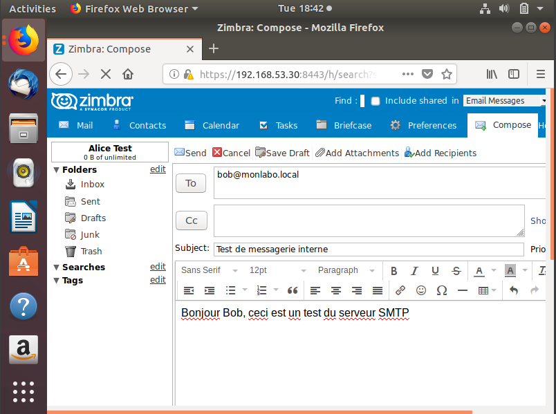

📧 Zimbra Mail Server Lab

Déploiement d'un serveur de messagerie complet avec Zimbra sur Ubuntu Server.
Intégration avec un serveur DNS BIND9 existant (monlabo.local), création de
comptes utilisateurs et tests d'envoi/réception d'emails entre utilisateurs.

🏗️ Architecture du lab

| Composant | Rôle | Adresse |
|---|---|---|
| Serveur DNS | BIND9 — résolution monlabo.local | 192.168.53.10 |
| Serveur Mail | Zimbra — SMTP/IMAP/Webmail | 192.168.53.30 |
| Client 1 | alice@monlabo.local | LAN |
| Client 2 | bob@monlabo.local | LAN |

⚙️ Stack technique

- **Zimbra** — Serveur mail complet (SMTP, IMAP, POP3, Webmail)
- **BIND9** — Serveur DNS avec enregistrements MX configurés
- **Ubuntu Server 22.04** — Système hôte
- **Dovecot** — Serveur IMAP/POP3
- **Roundcube** — Interface webmail

🚀 Étapes de déploiement

1. Configuration du hostname

Configuration du FQDN (Fully Qualified Domain Name) requis par Zimbra :

bash
sudo hostnamectl set-hostname mail

2. Vérification du FQDN

bash
hostname --fqdn
ping -c 4 mail.monlabo.local

3. Mise à jour DNS BIND9

Ajout des enregistrements dans les zones BIND9 :

Rechargement de BIND9 sans interruption :
bash
sudo rndc reload

### 4. Installation des dépendances Zimbra

bash
sudo apt update && sudo apt upgrade -y
sudo apt install -y [dépendances système requises]
sudo apt autoremove -y

5. Désactivation de systemd-resolved

Zimbra gère le DNS lui-même — désactivation du resolver système :

bash
sudo systemctl stop systemd-resolved
sudo systemctl disable systemd-resolved
sudo rm /etc/resolv.conf

Configuration de resolv.conf pour pointer vers BIND9 :

bash
sudo chattr +i /etc/resolv.conf

👥 Création des comptes utilisateurs

Création de deux comptes pour les tests :

| Utilisateur | Email | Mot de passe |
|---|---|---|
| Alice | alice@monlabo.local | Alice@123 |
| Bob | bob@monlabo.local | Bob@123 |

📨 Tests d'envoi et réception

Envoi d'email — Alice vers Bob

Réception par Bob

📊 Résultats obtenus

- ✅ Hostname et FQDN correctement configurés
- ✅ Enregistrements DNS MX et A mis à jour dans BIND9
- ✅ Zimbra installé et opérationnel
- ✅ Interface webmail accessible
- ✅ Comptes alice et bob créés
- ✅ Envoi et réception d'emails fonctionnels entre utilisateurs

🧠 Ce que j'ai appris

- Importance du FQDN pour le bon fonctionnement d'un serveur mail
- Intégration entre serveur DNS (BIND9) et serveur mail (Zimbra)
- Rôle des enregistrements MX dans la résolution du courrier
- Déploiement d'une solution mail complète en environnement Linux
- Gestion des conflits entre systemd-resolved et Zimbra

👤 Auteur

**Franck Nkombou**
Étudiant RSI3 — École Supérieure Technique La Salle, Douala

